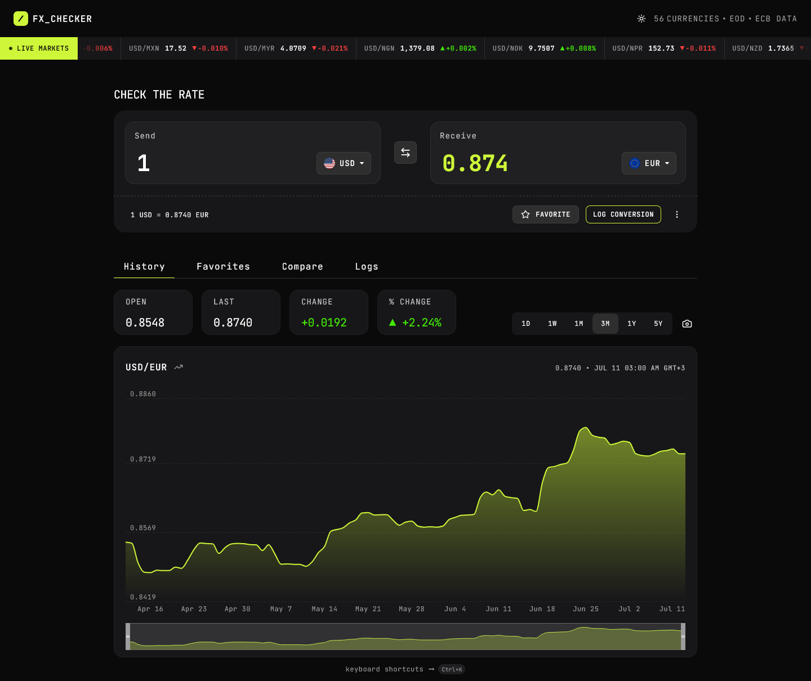

# FX Checker

A full-stack foreign exchange converter and rate-history dashboard built with TanStack Start.



## Links

Live URL - [Fx_Checker](https://fx.ayob.dev)

## Features

- **Converter** — enter an amount and see instant conversion with live rates; swap currencies, favorite pairs, and log conversions
- **Rate history chart** — line/area chart with selectable ranges (1D, 1W, 1M, 3M, 1Y, 5Y); SMA overlay; drag-to-zoom
- **Multi-currency comparison** — view send amount converted across multiple currencies at once; pin rows to favorites
- **Live markets ticker** — scrolling ticker of pairs with current rate and 24h change
- **Favorites** — pinned pairs with live rates; tap to load back into the converter
- **Conversion log** — history of conversions with relative timestamps; clear or delete individual entries
- **Dark/light theme** — dark-first design with a toggleable light theme
- **Keyboard navigation** — full keyboard support for all interactive elements; hotkeys for chart ranges (1–6)
- **Persistent URL** — active pair and amount are reflected in the URL; shareable/bookmarkable
- **CSV/JSON export** — download the conversion log as a CSV or JSON file

## Tech Stack

- **Framework**: [TanStack Start](https://tanstack.com/start/latest)
- **Routing**: [TanStack Router](https://tanstack.com/router/latest) — file-based, single route with Zod-validated search params
- **Data fetching**: [TanStack Query](https://tanstack.com/query/latest) with server functions
- **Styling**: [Tailwind CSS v4](https://tailwindcss.com/) via `@theme inline`; dark-first with `.light` class toggle
- **UI components**: [shadcn/ui](https://ui.shadcn.com/), [Base UI](https://base-ui.com/), [lucide-react](https://lucide.dev/)
- **Charts**: [Recharts](https://recharts.org/)
- **State management**: [Zustand](https://zustand-demo.pmnd.rs/) with `persist` (localStorage)
- **Linting/formatting**: ESLint, Prettier
- **Testing**: [Vitest](https://vitest.dev/) + [Testing Library](https://testing-library.com/)
- **Build**: Vite + Nitro + React Compiler

## Data Sources

- **[Frankfurter API](https://frankfurter.dev/)** (free, no key, no rate limits) — daily exchange rates backed by the European Central Bank. Used for the converter, ticker, comparison, and non-intraday history (1M+ ranges)
- **[Twelve Data](https://twelvedata.com/)** (free tier, ~15 min delay) — intraday OHLC data for 1D and 1W chart ranges. Rate-limited via a token bucket (**8 req/min** the free tier limits)

## Getting Started

```bash
pnpm install
pnpm dev            # http://localhost:3000
pnpm test           # 170+ tests
pnpm lint           # ESLint
pnpm format         # Prettier + ESLint --fix
pnpm build          # production build
```

## Architecture

| Path                         | Purpose                                                                               |
| ---------------------------- | ------------------------------------------------------------------------------------- |
| `src/routes/index.tsx`       | Single route with Zod-validated search params (`from`, `to`, `amount`, `view`, `sma`) |
| `src/server/functions/`      | Server functions proxying Frankfurter and Twelve Data APIs                            |
| `src/server/rate-limiter.ts` | Token bucket (8 req/min) gating Twelve Data calls                                     |
| `src/lib/currency/`          | Cross-rate helpers, formatting, flags, search                                         |
| `src/lib/history/`           | History helpers (invertData, cross-rate, SMA, stats)                                  |
| `src/store/`                 | Zustand stores (currencies, theme, loading state)                                     |
| `src/types/currency.ts`      | Shared TypeScript types                                                               |
| `src/styles.css`             | Tailwind v4 config + design tokens + theme variables                                  |

### API Key

Twelve Data requires an API key set via environment variable:

```
TWELVE_DATA_API_KEY=your_key_here
```

All other features work using the free Frankfurter API.

### AI Collaboration

This project was developed with [Opencode](https://opencode.ai/), a CLI-based AI coding agent. Opencode supports multiple models out of the box and allows connecting to any provider, making it a flexible alternative to hosted AI coding tools. Development was done using the `DeepSeek V4 Flash Free` model on Opencode's free tier, which provided solid reasoning and code generation throughout the project.

### Author

Github - [ahmadyousif89](https://github.com/ahmadyousif89)

Frontend Mentor - [Jo89 😈](https://www.frontendmentor.io/profile/AhmadYousif89)

## License

MIT
